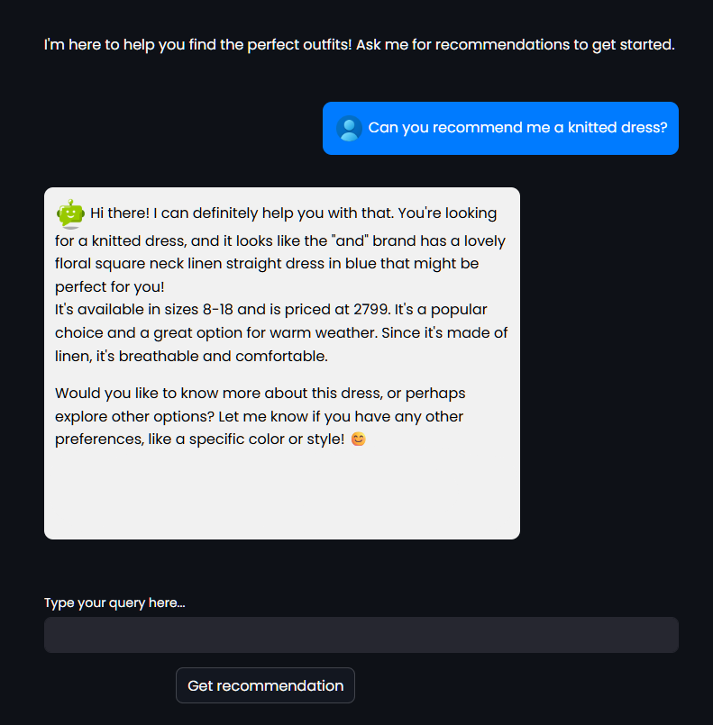
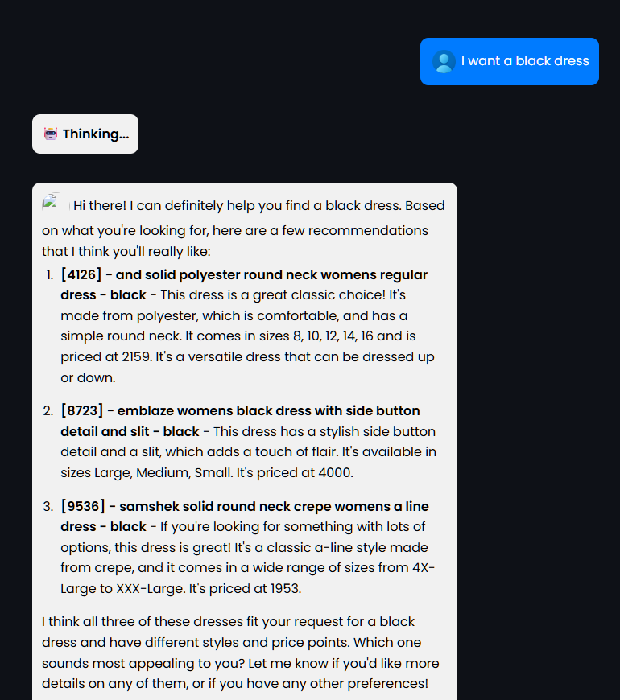

# Fashion Recommendation Chatbot - Proof of Concept

### Introduction

This is a prototype solution of an LLM-powered fashion recommendation system. The user can engage in conversation with the chatbot naturally, asking for suggestions and recommendations. The LLM generates queries to the vector databases as needed and returns the product recommendations whilst maintaining a natural conversation. 

### Technical Overview

This chatbot prototype is broken down into several workflows. The main components are the indexing and retrieving pipelines. I have used two forms of indexing, FAISS indexing and BM25 indexing. The results are then reencoded with HuggingFace Cross Encoder Reranker before finally being processed by the LLM. 

The whole chatbot uses a LangGraph workflow to tie all the components together. Upon received a user query, the bot first runs a check to evaluate if it is a relevant query or not. Messages that are completely irrelevent interrupt the chain, and the bot responds that it cannot handle such queries. 

For messages that are topical, the pipeline then calls the self query module, which retrieves the necessary documents through the retriever chains and returns the products to the pipeline. This is passed to the RAG module, which generates a response according the products that have been retrieved and returns a reponse to the user. 

### Features currently being hardware limited

The entire chatbot has been developed on a system with no GPU augmentation available. As such, there are some features which are unfortunately limited by the lack of resources. However, improved hardware should solve or improve these limitations. 

#### Query time

The greates handicap at present is the delayed query repsonse time. Generating LLM responses without a GPU is very taxing, so the average response time is well up to 15-20 minutes. This also unfortunately renders providing a live demonstration of the chatbot impossible at present. 

#### Response quality

In my attempts to mitigate the resources I require, I have opted to use ultra-lightweight models in places where a more robust model would be a better fit. This improves the performance but the quality of the responses decreases noticeable. If you're not opting to use an API for the LLM instead, I would recommend at the least upgrading to more robust and tuned models in the precense of better hardware. 

#### Occasional rejection of on-topic messages

Also due to opting to use ultra-lightweight models instead of more refined ones, the topic checking module sometimes rejects topical queries. The super lightweight model fails to understand more nuanced queries, and a better model choice will be required to solve this. 

